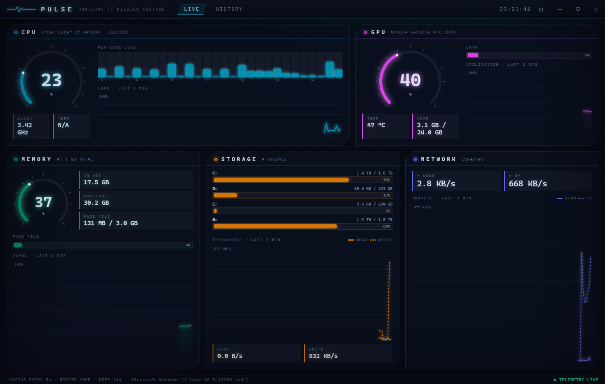

# PULSE — Hardware Mission Control

A futuristic real-time hardware monitor for Windows 11, built with **Electron** and
**systeminformation**, styled as a sci-fi mission-control console: dark holographic
theme, glowing radial gauges, streaming charts, and a scrubbable telemetry archive.



## What it monitors

| Subsystem | Metrics |
|---|---|
| **CPU** | average + per-core load, current clock speed, package temperature* |
| **RAM** | in-use / available, total, page-file usage |
| **GPU** | utilization, VRAM used/total, temperature* |
| **Storage** | per-volume capacity + usage, aggregate read/write throughput |
| **Network** | active adapter, download/upload throughput |

\* Temperatures depend on what the hardware exposes: GPU temp comes from
`nvidia-smi` (NVIDIA cards); CPU package temp uses WMI thermal zones, which many
consumer boards don't publish. Running the app **as administrator** improves
CPU-temp availability. When the CPU die sensor is unreadable, Pulse falls back to
the **coolant temperature of an AIO liquid cooler** (Corsair, NZXT Kraken,
Aquacomputer, MSI CoreLiquid, ASUS Ryujin, …) read from the
LibreHardwareMonitor / OpenHardwareMonitor WMI namespaces — this requires one of
those monitoring apps to be running. The tile is relabelled **COOLANT · AIO** so a
loop temperature is never mistaken for a die temperature; if neither source is
available it shows `N/A`. GPU usage/VRAM fall back to Windows GPU performance
counters, so they work on NVIDIA, AMD, and Intel.

Disk read/write throughput and the GPU fallback come from a single persistent
PowerShell child process reading Windows performance counters (spawning one shell
per sample would be far too slow).

## Requirements

- Windows 10/11
- [Node.js](https://nodejs.org) 18+ (tested on Node 24)

## Run it

```powershell
npm install
npm start
```

That's it. The window boots into the **LIVE** view; snapshots stream at the
configured sample interval (default 1 s).

## Persistent logging

Every snapshot is appended as one JSON line to rotating log files:

```
%APPDATA%\pulse\logs\pulse-YYYY-MM-DD.jsonl
```

- **Log interval** — how often a snapshot is written (default 5 s), independent of
  the dashboard refresh rate.
- **Size rotation** — when a file passes the max size (default 10 MB) it rolls to
  `pulse-YYYY-MM-DD.1.jsonl`, `.2`, …
- **Retention** — files older than the retention window (default 14 days) are
  deleted automatically.

All four knobs (sample interval, log interval, max file size, retention) are
editable in-app via the **⚙ CONFIGURATION** dialog and persist to
`%APPDATA%\pulse\settings.json`.

Each line is a self-contained snapshot, so the logs are trivially greppable /
`jq`-able:

```json
{"t":1751558400000,"cpu":{"avg":12.4,"cores":[8.1,15.2],"ghz":3.8,"temp":null,"tempSrc":null},
 "mem":{"total":34199306240,"used":18253611008,...},
 "gpu":{"util":7,"vramUsed":1352663040,...},
 "dsk":{"drives":[{"fs":"C:","size":...,"used":...,"pct":62.1}],"read":1048576,"write":524288},
 "net":{"iface":"Ethernet","rx":1250000,"tx":98000}}
```

## History view

Switch to the **HISTORY** tab to scrub back through past readings:

- pick any logged day from the dropdown,
- the overview chart plots CPU / GPU / RAM utilization across the whole range,
- **drag** across the chart (or use **← / →**) to move the playhead — the detail
  readout below reconstructs the full snapshot (per-core loads, VRAM, page file,
  disk and network rates) at that moment.

Long days are downsampled server-side to ≤1500 points, so scrubbing stays smooth
no matter how much has been logged.

## Build a Windows installer

```powershell
npm run dist
```

Produces an NSIS installer and a portable `.exe` under `dist/` via
electron-builder.

## Smoke test

```powershell
npm run smoke
```

Launches the app, waits for live snapshots, verifies the renderer painted,
captures a screenshot, prints a `SMOKE_REPORT` JSON line, and exits non-zero on
failure. Useful for CI.

## Project layout

```
src/
  main/
    main.js        app lifecycle, window, IPC, smoke mode
    sampler.js     merges systeminformation + perf-counter data into snapshots
    pscounters.js  persistent PowerShell perf-counter bridge (disk I/O, GPU)
    logger.js      rotating JSONL metrics logger
    history.js     reads/downsamples logs for the history view
    settings.js    persisted configuration
  preload.js       contextBridge API (contextIsolation on, nodeIntegration off)
  renderer/
    index.html     layout: live grid + history panel
    styles.css     mission-control theme
    charts.js      canvas engine: radial gauges, streams, core bars, scrubber
    app.js         view wiring
```
